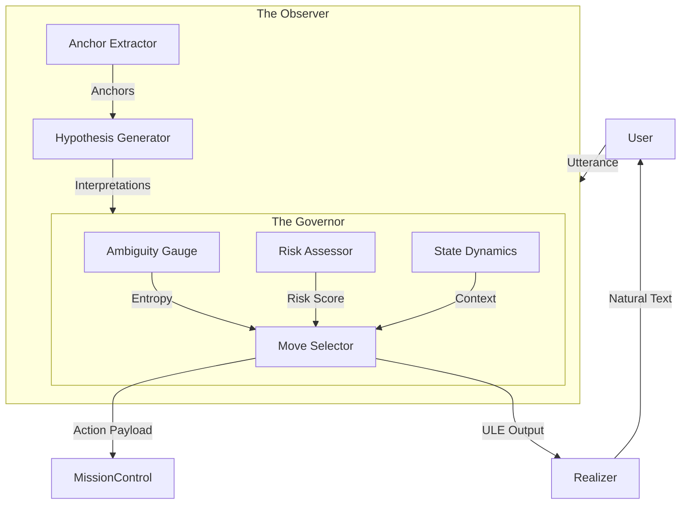

# ULE Architecture: The JARVIS Implementation

> "Implementation of the Two-Plane Architecture for Safe Conversational AI."

---

## 1. High-Level Design

The system is divided into two orthogonal planes as prescribed by **Theorem 2.1**.

---

## 2. Component Implementation

### 2.1 Cognitive Plane (`core/ule/cognitive.py`)

Responsible for **Observation** and **Interpretation**. It does *not* decide what to do.

*   **AnchorExtractor:**
    *   **Logic:** Hybrid Syntax-Semantic extraction.
    *   **Syntax:** Uses `spacy` to identify Noun Chunks and Verbs.
    *   **Semantics:** Uses `sentence-transformers` to calculate `AnchorWeight` (Section 3.1 of Theory).
    *   **Key Feature:** Detects ungrounded references ("it", "that") as ambiguity triggers.

*   **HypothesisGenerator:**
    *   **Logic:** Vector-Based Intent Matching.
    *   **Math:** `CosineSimilarity(InputVector, IntentVector)`.
    *   **Constraints:** Bounds output to $k=4$ (Theorem 2.2).
    *   **Dynamic Generation:** Can generate novel hypotheses ("Research Quantum Physics") by detecting semantic roles.

### 2.2 Control Plane (`core/ule/control.py`)

Responsible for **Decision** and **Safety**. It is the authoritative governor.

*   **AmbiguityGauge:**
    *   **Math:** Shannon Entropy $H(X) = -\sum p(x)\log p(x)$.
    *   **Role:** If $H > A_{crit}$, forces `Move.CLARIFY` (Theorem 2.3).

*   **RiskAssessor:**
    *   **Math:** $Risk(h) \times \frac{1}{1 + \tau}$.
    *   **Role:** Scales risk based on current Trust. Low trust = High sensitivity.

*   **MoveSelector:**
    *   **Optimization:** Selects $m^*$ that minimizes cost.
    *   **Safety:** If $Risk > Threshold$, forces `Move.REFUSE`.

### 2.3 State Dynamics (`core/ule/dynamics.py`)

*   **Goal Stack:** Tracks nested contexts (Stack Push/Pop logic) to handle interruptions.
*   **Trust Evolution:** Bounded increments prevent manipulation (Theorem 2.4).

---

## 3. The "Voice" (Realization)

*   **Realizer (`core/ule/realizer.py`):**
    *   Converts abstract Moves (`CLARIFY`) into natural text.
    *   Uses **Template Selection** based on Move Type and Freshness.
    *   Uses **Slot Filling** to inject context ("Did you mean *EDITH*?").

*   **Linguistic Observer:**
    *   Extracts syntactic skeletons from read text to grow the grammar library (One-Shot Learning).
